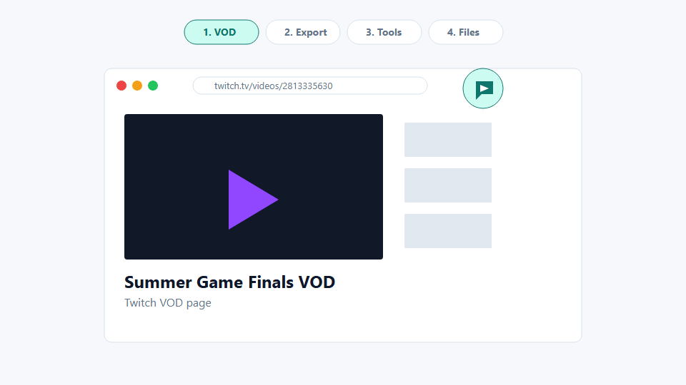
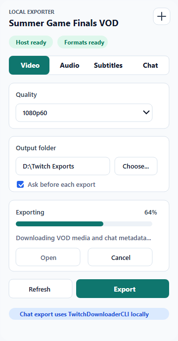
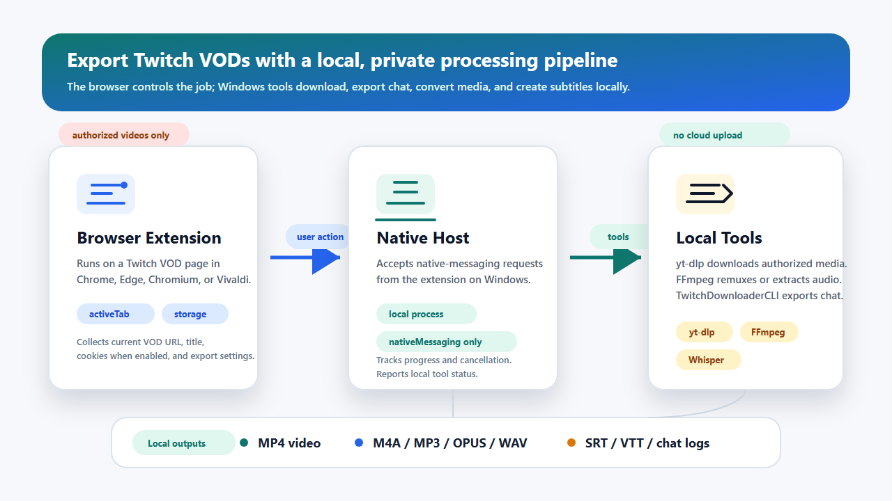

# Twitch Local Exporter

[](https://github.com/Tokenyet/twitch_local_exporter/actions/workflows/ci.yml)
[](https://github.com/Tokenyet/twitch_local_exporter/releases)
[](LICENSE)

Turn the current Twitch VOD tab into a local export pipeline.

Twitch Local Exporter is a Windows-first Chromium extension that exports video, audio, captions, and VOD chat from the current Twitch VOD page to local files. It runs `yt-dlp`, FFmpeg, optional Whisper transcription, and TwitchDownloaderCLI through a local native host, so you do not have to copy URLs or remember one-off terminal commands.

No cloud transcription. No analytics. Generated media and chat logs stay on your machine.



## Why Use It

- Export the current Twitch VOD tab instead of pasting URLs into a terminal.
- Reuse your signed-in browser session when `yt-dlp` can use Twitch cookies.
- Save MP4 video, audio-only files, SRT/VTT subtitles, or VOD chat logs.
- Prefer Twitch-provided caption tracks when exposed by the downloader, and fall back to local Whisper transcription when no track is available.
- Convert Chinese subtitle output to Traditional Chinese (Taiwan) with OpenCC when requested.
- Export VOD chat as JSON, HTML, or plain text through TwitchDownloaderCLI.

## Quick Start

1. Download `twitch-local-exporter-vX.Y.Z-windows.zip` from Releases.
2. Extract the ZIP.
3. Open `chrome://extensions`, `edge://extensions`, or your Chromium browser's extensions page.
4. Enable `Developer mode`.
5. Choose `Load unpacked`.
6. Select the extracted `extension` folder.
7. Copy the generated extension ID.
8. Open PowerShell in the extracted release folder and run:

```powershell
.\scripts\install-native.ps1 -ExtensionId <extension-id> -Browser chrome
.\scripts\update-tools.ps1
```

Use `-Browser edge`, `-Browser chromium`, `-Browser vivaldi`, or omit `-Browser` to register all supported browser registry paths.

Open a Twitch VOD page like `https://www.twitch.tv/videos/<vod-id>`, click the extension icon, choose `Video`, `Audio`, `Subtitles`, or `Chat`, pick an output folder, then start the export.

## What It Exports

- MP4 video with a selected maximum quality.
- Audio as m4a, mp3, opus, wav, or best available.
- Subtitles as SRT or VTT.
- Local Whisper subtitles when Twitch captions are missing or when forced.
- Optional Chinese subtitle conversion from Simplified/mixed Chinese to Traditional Chinese (Taiwan).
- VOD chat as JSON, HTML, or text.

## Screenshots




## Technical Architecture



The flow is: **Twitch VOD tab → extension popup → Windows native host → local tools → selected output folder**. The Manifest V3 extension reads the active Twitch tab only when you open the popup; it sends the export request to a Windows native messaging host, which runs the local toolchain and writes generated files to your selected output folder.

`TwitchDownloaderCLI` is used for chat export because its `chatdownload` mode supports VOD chat output as JSON, HTML, or text. Media and Whisper subtitle fallback use `yt-dlp`, FFmpeg, and whisper.cpp. Chinese subtitle conversion uses OpenCC `s2twp` after the subtitle file is produced, leaving VOD chat text unchanged.

## Release Downloads

- `twitch-local-exporter-vX.Y.Z-windows.zip`: complete Windows sideload bundle. Start here.
- `twitch-local-exporter-extension-vX.Y.Z.zip`: extension-only runtime package for inspection or custom installation.
- `twitch-local-exporter-host-vX.Y.Z-windows-x64.exe`: standalone native host executable included in the Windows bundle.
- `SHA256SUMS.txt`: checksums for release downloads.

## Requirements

- Windows 10 or 11.
- Chrome, Edge, Chromium, or Vivaldi.
- PowerShell.
- Python 3.11 or newer if you install from source without the release-built native host executable.
- `opencc-python-reimplemented`, installed automatically by `install-native.ps1` for source-based Python host installs.

`update-tools.ps1` downloads helper tools into `%LOCALAPPDATA%\TwitchLocalExporter\tools`:

- `yt-dlp`
- TwitchDownloaderCLI
- Deno for `yt-dlp` JavaScript runtime support
- FFmpeg and FFprobe
- whisper.cpp
- the selected Whisper model

## Install From Source

```powershell
git clone https://github.com/Tokenyet/twitch_local_exporter.git
cd twitch_local_exporter
.\scripts\package.ps1
```

Load this folder from your browser's extensions page:

```text
dist\unpacked\twitch-local-exporter
```

Copy the generated extension ID, then install the native messaging host:

```powershell
.\scripts\install-native.ps1 -ExtensionId <extension-id> -Browser chrome
.\scripts\update-tools.ps1
```

The source installer creates a `.cmd` launcher that runs the Python native host. To install a standalone executable instead:

```powershell
.\scripts\build-native.ps1
.\scripts\install-native.ps1 -ExtensionId <extension-id> -Browser chrome
```

When `native-host\dist\twitch-local-exporter-host.exe` exists, the installer copies and registers that executable.

## Privacy And Permissions

Media, subtitle, and chat export jobs are processed locally by the native host. The extension does not collect analytics, send generated media to a remote service, or use cloud transcription.

Permissions:

- `activeTab`: reads the current tab only when you open the extension popup.
- `nativeMessaging`: talks to the local native host that performs exports.
- `storage`: stores extension preferences such as default folder, export mode, formats, and subtitle settings.
- `cookies`: optionally provides Twitch cookies to local tools for VODs your browser session is allowed to access.
- Twitch host permissions: limited to Twitch VOD pages and Twitch cookies needed for signed-in exports.

See [docs/PRIVACY.md](docs/PRIVACY.md) for the short privacy note.

## Development

Run validation:

```powershell
node --check src\background.js
node --check src\content.js
node --check popup\popup.js
node --check options\options.js
node scripts\smoke-test.mjs
python -m unittest discover -s native-host\tests
```

Package the extension runtime:

```powershell
.\scripts\package.ps1
```

Package release assets locally:

```powershell
.\scripts\build-native.ps1
.\scripts\package-release.ps1 -Version 0.1.0
```

## Release Workflow

CI runs on pushes and pull requests. The release workflow runs when a tag like `v0.1.0` is pushed, or manually from GitHub Actions with a version input.

```powershell
git tag v0.1.0
git push origin v0.1.0
```

The workflow validates the extension, builds the Windows native host executable, packages release downloads, writes checksums, and publishes a GitHub Release with notes from [CHANGELOG.md](CHANGELOG.md).

## Scope

This project is built for local sideload use. It is not a Chrome Web Store release target in v0.1.0. It does not support batch jobs, DRM bypassing, paywall bypassing, or cloud transcription.

Use this tool only for Twitch VODs you own or are authorized to export.

## License

MIT. See [LICENSE](LICENSE).
